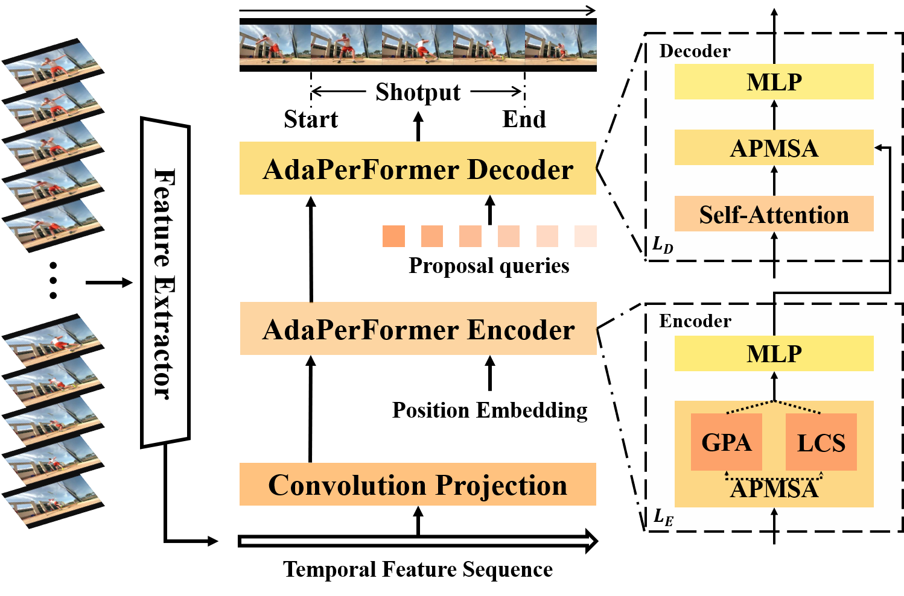

# AdaPerFormer: Adaptive Perception Transformer for Temporal Action Localization

## Introduction
This code repo implements AdaPerFormer, described in the technical report: [AdaPerFormer](http://arxiv.org/abs/2208.11908) 
We had some undeserved code commits before, and the correct code will be released as soon as possible.
